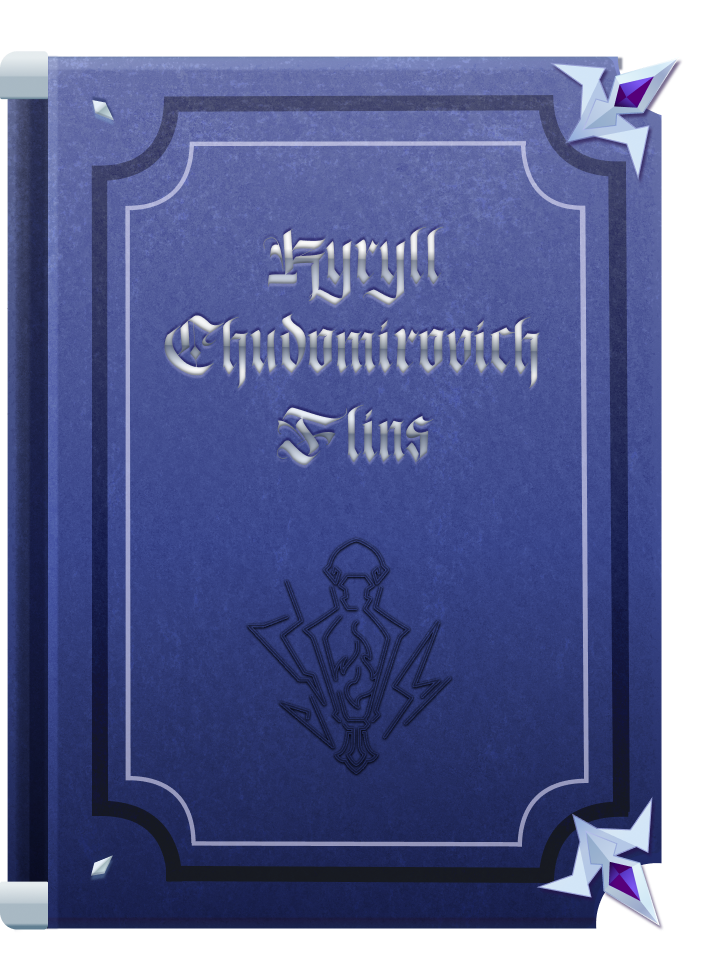

# Flins' Notes

A  Windows desktop reminder app with a book-themed planner and Flins as a desktop pet!

## **Book:** 
- schedule reminders with alarms
    - day/week views,
- achievements log
- adjust alarm and voiceline volume

## **Flins:**
- drag Flins around your desktop
- click him for up to 19 unique voicelines
- use the right-click menu to access menu to:
    -  set your name
    -  pin a sticky message
    -  set timer
    -  switch styles (animated, lantern, sticker)
- Has 2 easter eggs ( ◠‿◠ )

## **How to Run:** 
1. Download the exe
2. Unblock
3. Run and note your wins with Flins!
